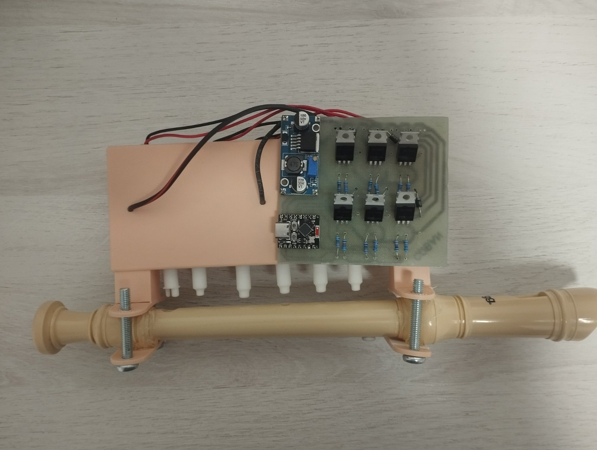
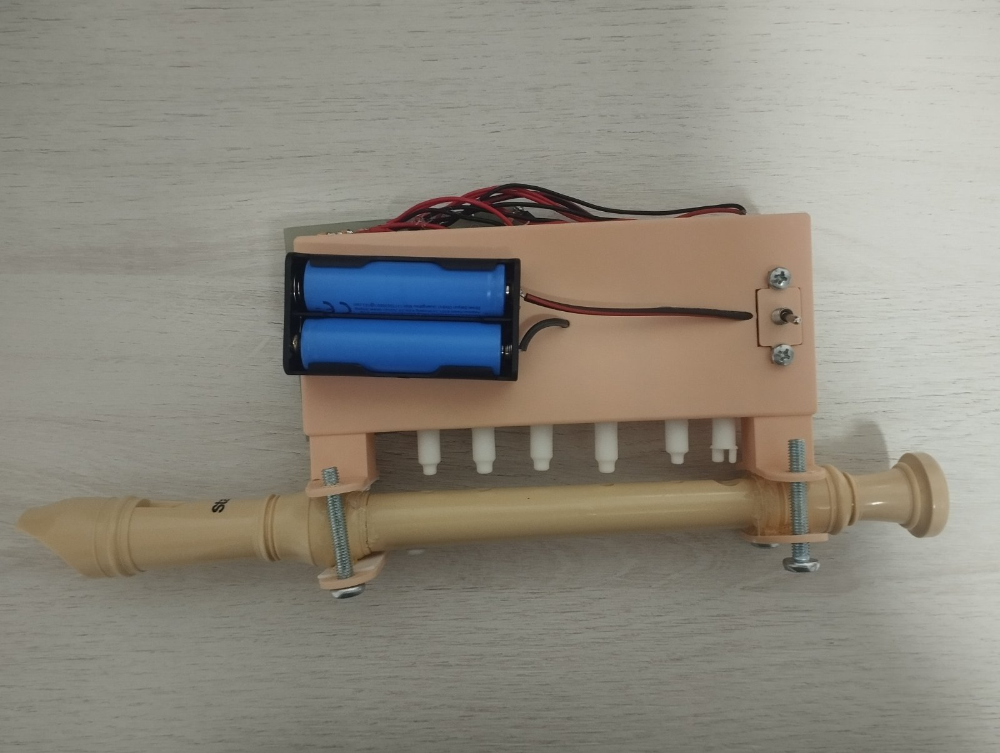
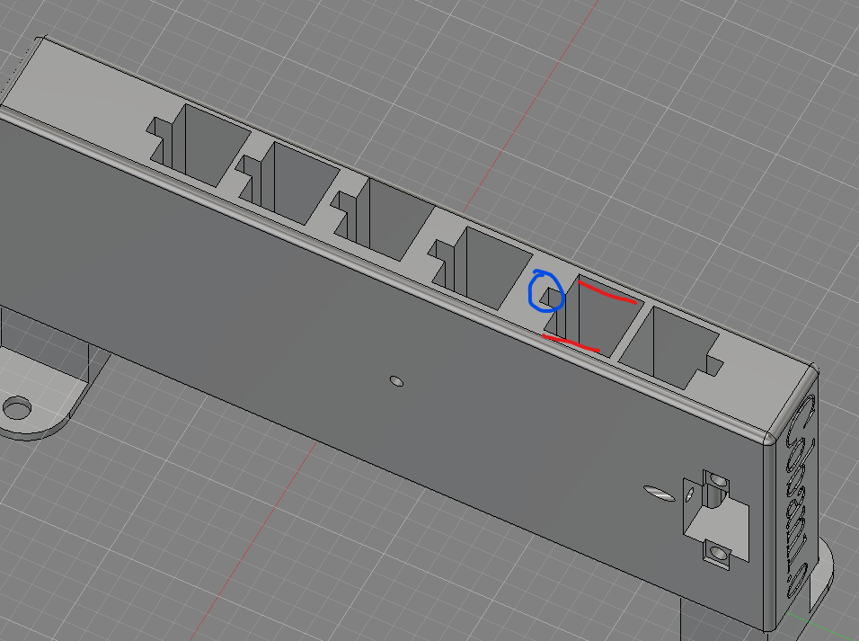
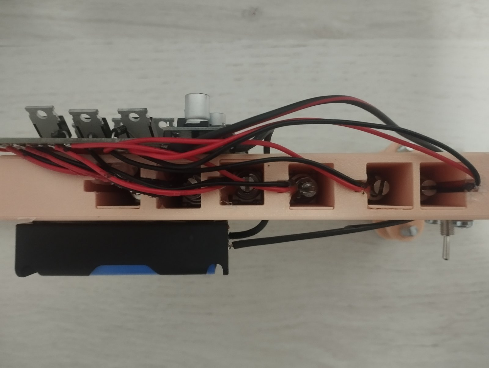
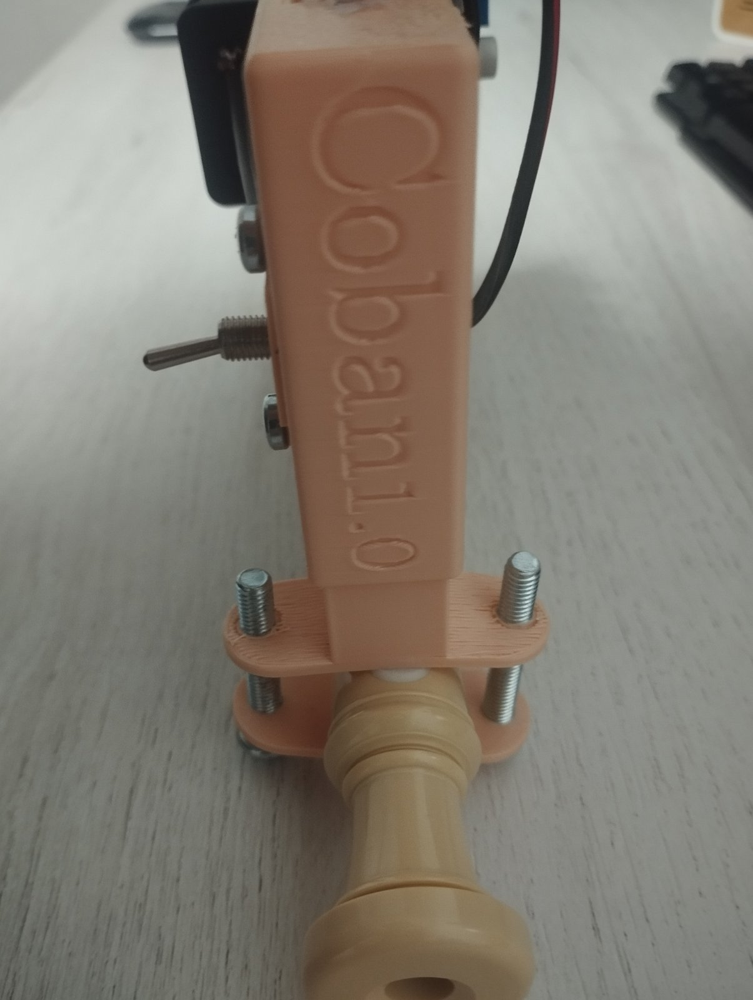
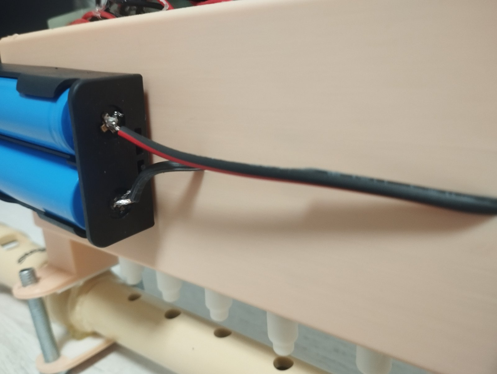

# Coban 1.0

Coban is a robotic recorder project built around a modified Stagg German-style
soprano recorder, an ESP32-C3 Super Mini, six solenoids, a custom PCB, 3D
printed mounting parts, and a Flutter Android app.

The app sends fingering commands over Bluetooth Low Energy to the ESP32-C3. The
ESP32-C3 then drives six solenoids that cover the recorder holes. The recorder
used here is modified as a six-hole instrument by blocking the thumb hole and
the seventh hole.



## What Is Included

```text
lib/                         Flutter app source
test/                        Flutter tests
firmware/esp32c3_recorder/   ESP32-C3 Arduino firmware
hardware/                    PCB export and 3MF print files
docs/images/                 Build photos and CAD reference image
release-apk/                 Public no-key Android APK
android/                     Android Flutter project
windows/                     Windows Flutter project
```

The included APK is:

```text
release-apk/Coban-android-arm64-v8a-no-gemini-key.apk
```

This APK is safe to publish because it does not contain a Gemini API key. Manual
mode and Bluetooth control still work, but Gemini sheet-photo translation needs
you to build the app with your own key.

## Main Parts

These are the product links used during the build.

| Part / use | Link |
| --- | --- |
| 18650 Li-ion batteries | https://share.temu.com/AAxxFDRMDZB |
| JF-0530B 5 V push solenoids | https://share.temu.com/nRcJicoiy4B |
| IRLZ44N / IRLZ-series MOSFETs | https://share.temu.com/BM2HjPwDSDB |
| ESP32-C3 Super Mini | https://share.temu.com/fQ0xgR6FktB |
| LM2596 buck converter | https://share.temu.com/UVUPquIY3JB |
| 2-cell 18650 battery holder | https://share.temu.com/3RumAjBXD8B |
| Mini toggle switches | https://share.temu.com/ZeoLe3awByB |
| TP4056 charging modules | https://share.temu.com/UvcupIY5FiB |
| Red/black speaker wire | https://www.temu.com/search_result.html?search_key=2%20core%20speaker%20wire%20red%20black |

Extra parts and materials:

- Stagg Descant Recorder in cream:
  https://www.giggear.co.uk/stagg-descant-recorder-cream.htm
- 6x 10 kOhm resistors.
- 6x 220 Ohm resistors.
- 6x 1N4001 diodes.
- 4x M6 x 40 mm Phillips-head machine screws/bolts for the main recorder clamp.
- 2x M4 x 6 mm Phillips-head machine screws/bolts for the switch plate.
- Double-sided tape for mounting the PCB and battery holder.
- eSun beige PLA for the main body and rigid printed parts.
- BASF Ultrafuse TPS 90A in white for the flexible valves.
- Printed on a Bambu Lab P2S.

The battery holder/station wires were replaced with thicker speaker wire. The
original wires were about 1 mm and did not have enough current capacity for the
solenoids.



## Hardware Files

The `hardware/` folder contains:

- `Coban main body.3mf`
- `solenoid spacers.3mf`
- `valves.3mf`
- `PCB_PCB_Coban-1.0_2026-06-30.json`
- `PCB_PCB_Coban-1.0_2026-06-30.svg`

The main body is printed in beige PLA. The valves must be printed from flexible
TPS or TPU. Rigid plastic does not work for the valves because the design relies
on the plastic bending and snapping onto the solenoid.

## Solenoid And Valve Setup

The solenoids are used as push solenoids, not pull solenoids. Install the white
flexible printed valve on the push side of each solenoid, on the small circular
plunger side.

Important: remove the original O-ring from the solenoid before installing the
printed valve. The printed flexible valve replaces the job of the O-ring.

The CAD reference image marks two important things:

- Red marks: possible locations for the solenoid spacer. Use either position to
  lock the solenoid in place so it cannot move.
- Blue mark: the cable path. Route the wires this way because the solenoids are
  being used in the push direction.





## Mounting

The main printed body clamps around the recorder with the four M6 x 40 mm
machine screws/bolts. The battery pack sits on the side/top of the printed body.
The PCB and the battery pack are mounted with double-sided tape.

The switch plate uses the two M4 x 6 mm machine screws/bolts.



The upgraded battery wire is shown below. This wire was used because the battery
holder wires were too thin for the solenoid current.



## Solenoid Order And GPIO Mapping

Hole order is from the mouthpiece toward the foot of the recorder.

```text
hole 1 -> GPIO 1
hole 2 -> GPIO 6
hole 3 -> GPIO 5
hole 4 -> GPIO 2
hole 5 -> GPIO 3
hole 6 -> GPIO 4
```

The firmware and app both use this same order.

Do not power the solenoids directly from ESP32 GPIO pins. Use MOSFET/transistor
drivers, flyback diodes, a solenoid power supply, and a shared ground.

## Recorder Fingering Range

This is not a full normal recorder anymore because the thumb hole and seventh
hole are blocked. The app is built around a practical six-hole range:

```text
E4, F4, F#4, G4, G#4/Ab4, A4, A#4/Bb4, B4, C5, C#5, REST
```

Generated songs are simplified into this limited range. Manual songs preserve
the exact hole pattern you enter, including patterns that are not part of the
generated-song note table.

## App Features

- Bluetooth connection to an ESP32-C3 advertising as `Coban`
- Saved songs
- Rename saved songs
- Stop playback
- Manual song creator
- Tap timing recorder
- Delay division for recordings made from slowed-down videos
- Editable millisecond duration for every manual fingering
- Exact manual hole patterns
- Live hole trigger controls
- Sheet-photo to melody conversion with Gemini when built with an API key
- Breath guide for generated songs

## Building The App

Install Flutter, then run:

```powershell
flutter pub get
flutter analyze
flutter test
```

To run or build with Gemini enabled, pass your own Gemini API key with
`--dart-define`. Do not commit API keys.

```powershell
$env:GEMINI_API_KEY = "your-gemini-api-key"
flutter run --dart-define="GEMINI_API_KEY=$env:GEMINI_API_KEY"
```

Release build:

```powershell
$env:GEMINI_API_KEY = "your-gemini-api-key"
flutter build apk --release --split-per-abi --dart-define="GEMINI_API_KEY=$env:GEMINI_API_KEY"
```

For most modern Android phones, use the generated `app-arm64-v8a-release.apk`.

## Firmware Setup

Open this file in Arduino IDE:

```text
firmware/esp32c3_recorder/esp32c3_recorder.ino
```

Arduino IDE requirements:

- ESP32 board package by Espressif Systems
- `ArduinoJson` library
- ESP32-C3 Super Mini or compatible ESP32-C3 board selected

The ESP32-C3 advertises as:

```text
Coban
```

BLE UUIDs:

```text
Service UUID:        4fafc201-1fb5-459e-8fcc-c5c9c331914b
Characteristic UUID: beb5483e-36e1-4688-b7f5-ea07361b26a8
```

The app writes JSON note packets like:

```json
{"t":"note","n":"A4","m":3,"d":500,"b":0.56}
```

Fields:

- `t`: packet type, usually `note`
- `n`: note name for display
- `m`: six-bit fingering mask
- `d`: duration in milliseconds
- `b`: breath intensity for the app UI

## Safety Notes

This is a hobby robotics/electronics project. Check wiring before powering the
solenoids, keep grounds common, use flyback diodes, and make sure the battery
wiring can handle the solenoid current.

The public repository and APK must not contain a Gemini API key.
